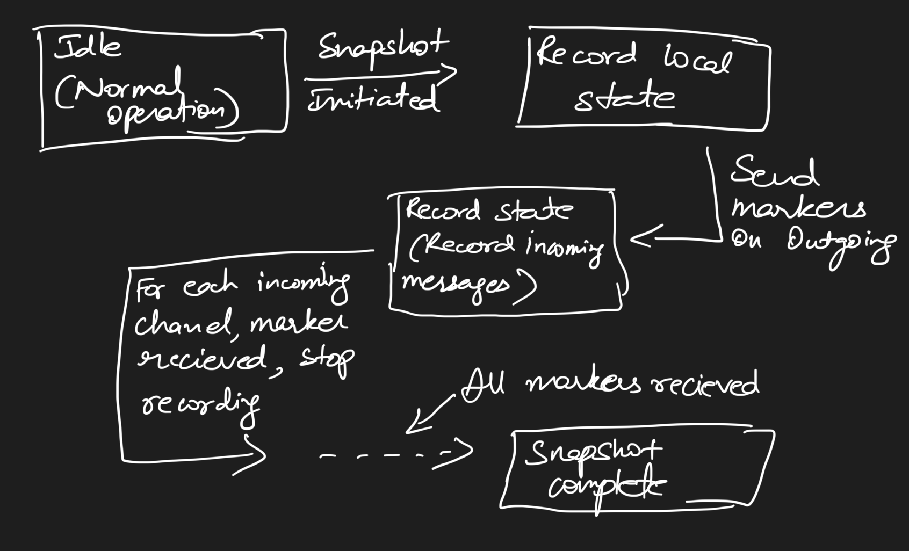

The **Chandy-Lamport snapshot algorithm** is designed to capture a consistent global state of a distributed system without interrupting its operation. It enables each process in the system to record its local state and the state of incoming communication channels. The algorithm initiates when a process decides to take a snapshot: it records its state, sends marker messages to its neighbors, and starts recording incoming messages on each channel until a marker is received on that channel. This ensures that the snapshot captures not only the state of processes but also the messages in transit, providing a coherent view of the system at a specific point in time.

**Our code** implements this algorithm by allowing any process to initiate a snapshot once it reaches a certain state, specified via command-line parameters. The code handles the sending and receiving of marker messages, recording of local states, and the tracking of in-transit messages using consistent channel naming based on process IDs. It uses TCP connections for inter-process communication and supports optional parameters for flexibility, making it adaptable to different deployment scenarios, such as those defined in Docker Compose files. The implementation ensures that snapshots are correctly taken even in complex network configurations, facilitating the analysis and debugging of distributed systems.

### Step-by-Step Explanation of Our Chandy-Lamport Algorithm Implementation

#### 1. Process Initialization

- **Command-Line Arguments**: The process reads optional parameters:
  - `-h <hostsfile>`: Hosts file.
  - `-m <marker_delay>`: Marker delay.
  - `-t <sleep_time>`: Sleep time between state increments.
  - `-s <snapshot_state>`: State at which to initiate a snapshot.
  - `-p <snapshot_id>`: Snapshot identifier.
  - `-x`: Indicates the token initiator.

- **Process Setup**: Determines its `proc_id`, predecessor, and successor based on the hosts file.

#### 2. Communication Setup

- **TCP Listener**: Starts a listener on port `8080` to receive messages.
- **Token Initiation**: If the `-x` flag is present, sends a token to its successor after a brief wait.

#### 3. Normal Operation

- **State Increment**: Periodically increments its state based on `sleep_time`.
- **Token Handling**: Upon receiving a token:
  - Increments its state.
  - Records the token if a snapshot is in progress.
  - Forwards the token to its successor after `sleep_time`.

#### 4. Snapshot Initiation

- **Trigger**: If `-s <snapshot_state>` is specified, initiates a snapshot when the state reaches the specified value.
- **Snapshot ID**: Generates a unique `snapshot_id` if not provided.

#### 5. Starting the Snapshot

- **Recording Local State**: Captures the current state.
- **Recording Flags**: Sets `recording = true`.
- **Channel Setup**: Opens all incoming channels for recording and initializes message queues.
- **Sending Markers**: Sends marker messages to all other processes after `marker_delay`.

#### 6. Marker Handling

- **Receiving a Marker**:
  - If not recording, starts recording and sends markers.
  - Closes the channel on which the marker was received.
  - Records any messages received before the marker.

- **Recording Messages**: Continues to record messages on open channels.

#### 7. Snapshot Completion

- **Checking Channels**: Monitors whether markers have been received on all channels.
- **Finalizing Snapshot**:
  - Once all channels are closed, sets `recording = false`.
  - Logs the snapshot data, including local state and in-transit messages.

#### 8. Resuming Normal Operation

- **Continuing Operations**: Returns to normal activities and is ready for future snapshots.

#### 9. Handling Multiple Snapshots

- **Snapshot IDs**: Uses `snapshot_id` to differentiate between concurrent snapshots.
- **Ignoring Unrelated Markers**: Discards markers for snapshots it is not participating in.

#### 10. Inter-Process Communication

- **Message Sending**: Uses TCP connections to send tokens and markers.
- **Channel Naming**: Consistent naming using `senderID->receiverID`.
- **Message Format**: Key-value pairs in messages (e.g., `marker,proc_id:2,snapshot_id:1`).

---

By following these steps, our implementation effectively captures consistent global states in a distributed system without interrupting normal operations. The code is adaptable and handles snapshots correctly even in complex configurations.

### State Diagram:

